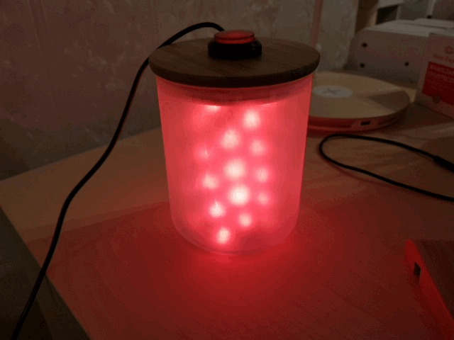
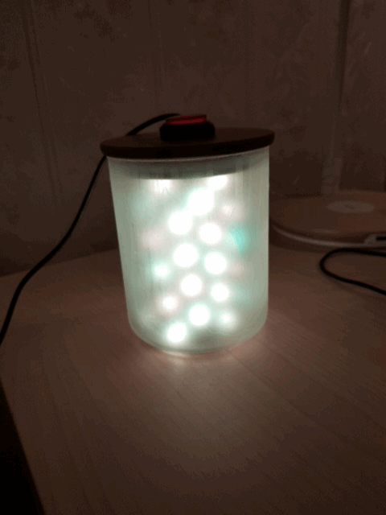
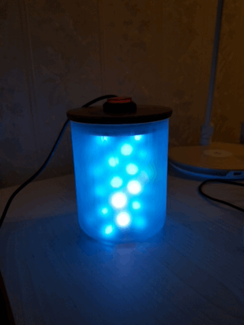
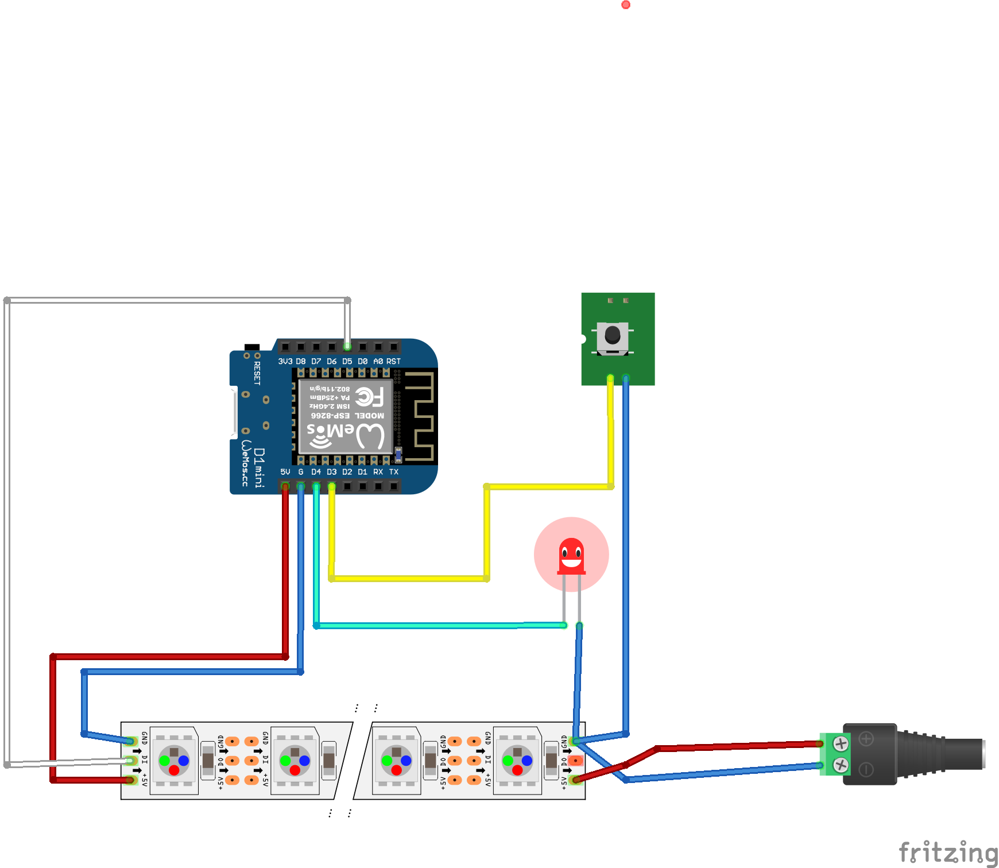
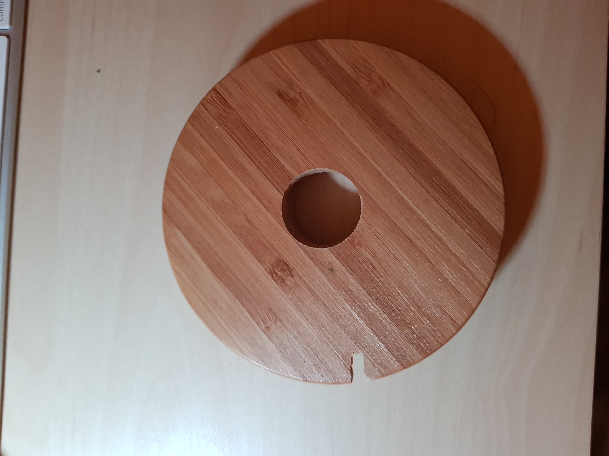
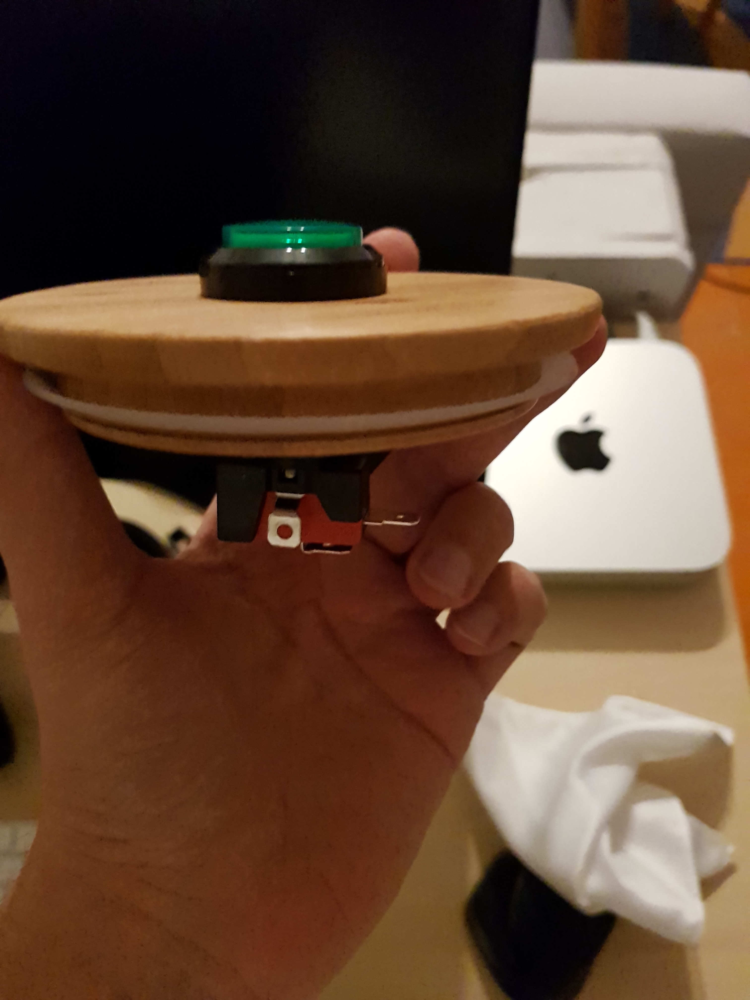
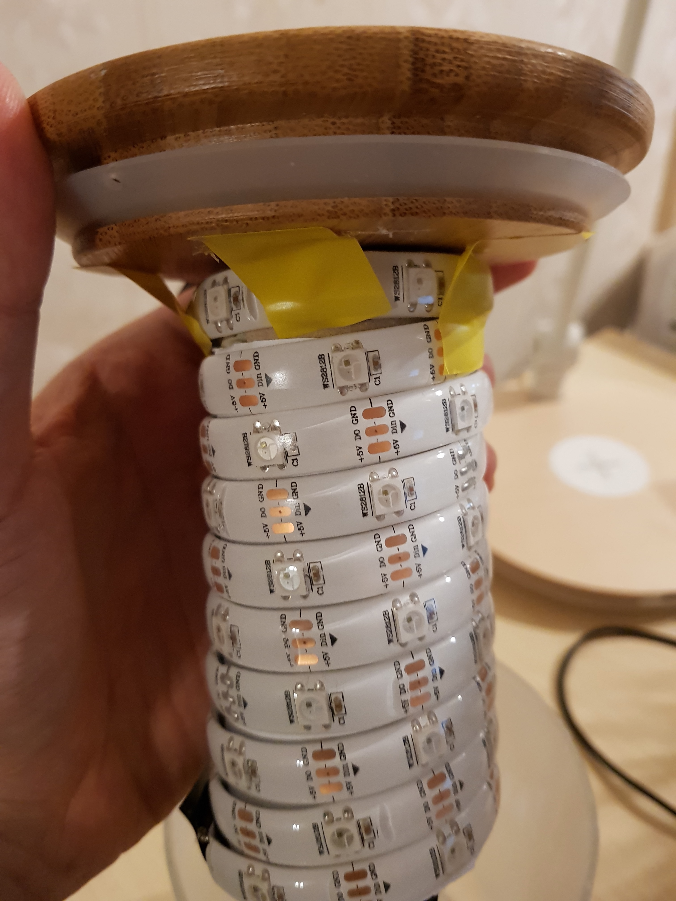

# lam.py

Led lamp that displays information about current jenkins build status. Main features:

* Automaticaly turn on/off if user is logged on Jipchat
* Beam effect if somebody makes coffee([How i know that](http://codesthq.com/blog/2016/how-did-we-hack-coffeemaker-and-had-fun-with-it.html))
* Unicorn effect if food is delivered(via. [lunching.pl](http://lunching.pl))
* Big red arcade button that can send random message to somebody on Hipchat
* Change color depending on [Jenkins](https://jenkins.io/) build status

## How it works:
On separate server(in my case Raspberry Pi under my couch), there is running python script that periodically fetch information from jenkins and other endpoints. Any change is then published to separate MQTT topic. Each lamp subscribe to topics and animates acording to event:

https://www.youtube.com/watch?v=UrOeL2-fV0c

## Failing builds


## Running builds


## Success builds


## Wiring


## Requirements

* [IKEA Jar EKLATANT](http://www.ikea.com/pl/pl/catalog/products/10376601/)
* Arcade button(everything is better with arcade button)
* Automatically D1 mini
* NeoPixel 5V LED RGB WS2812B strip
* Wires(of curse,)
* Toilet paper inner tube
* 4 amp power source
* Frozen glass spray
* Server with LINUX to run python script and MQTT server

## Preparing device

### Make hole in the lid of the jar and put arcade button
Additionaly add small hole for power coord.


### Apply frozen glass effect to glass jar
I needed to apply 3 coatings before it look cool.

### Wrap the tube using led strip and connect elements
Mount tube using tape, and put everything inside.


### Upload code to Wemos D1 mini

Open `device/device.ino` in arduino ide. Copy `credentials.h.example` to `credentials.h`. Update it with your credentials and upload to Wemos D1.

## Configuration of server

After cloning run:

```
pip3 install -r requirements.txt
```

Edit home configuration under `config.yaml` and run it:

```
python3 src/lam.py
```

## Example systemd service file

```
sudo cp systemd/lam.py.service /lib/systemd/system/
sudo systemctl enable lam.py
sudo systemctl start lam.py
```

## Free MQTT brokers

* https://github.com/mqtt/mqtt.github.io/wiki/public_brokers
* https://customer.cloudmqtt.com/login
